# Local LLM Pilot Architecture

**Review status:** Current-state architecture for team review
**As of:** 2026-09-28

## 1. Purpose and objective

The project is a local language-model learning and feasibility pilot. Its objective is to establish a practical, repeatable way to run a small model on the available 8 GB Intel MacBook Pro, practice prompting, and gather enough evidence to decide whether local inference is useful for modest tasks.

The primary objective is not to build a production inference service. The design prioritizes a working local path, low setup friction, short prompts, and saved observations. Fine-tuning, large models, cloud inference, and a full Transformers/PyTorch stack remain out of scope for the current pilot.

The acceptance criteria for the original pilot are recorded as met in [spec.md](spec.md). The project has since added a lightweight local web dashboard, beyond the original command-line prompt-lab plan.

## 2. System context

The system runs on one developer machine. Ollama manages model storage and inference and exposes its local HTTP API on `127.0.0.1:11434`. The primary model is `qwen2.5:3b`; `tinyllama:latest` is available for comparison. Inference is CPU-only, so response times vary and the workload should remain modest.

```mermaid
flowchart LR
    Person[Developer] --> Direct[Ollama CLI]
    Person --> Runner[Prompt-runner script]
    Person --> PyCLI[Python HTTP client]
    Person --> Browser[Local browser]
    Browser --> Flask[Flask dashboard on 127.0.0.1:3000]
    Direct --> Ollama[Ollama service on 127.0.0.1:11434]
    Runner --> Ollama
    PyCLI --> Ollama
    Flask --> Ollama
    Runner --> Runs[(runs/ prompt records)]
    Flask --> Runs
    Flask --> Docs[Project documentation]
```

All inference routes use the same local Ollama service, but the clients are independent entry points. The dashboard calls Ollama's API directly; it does not invoke or wrap `ollama_client.py`.

## 3. Components and responsibilities

| Component | Responsibility | State and interface |
| --- | --- | --- |
| Ollama | Loads installed models and performs local inference. | Local service at `127.0.0.1:11434`; primary model `qwen2.5:3b`, comparison model `tinyllama:latest`. |
| `run_prompts.sh` | Runs a fixed three-prompt set and records output for repeatable practice. | Select model with `MODEL`; writes timestamped text files under `runs/`. Checks for the Ollama command and reachable local API before inference. |
| `ollama_client.py` | Offers a dependency-free Python CLI for one prompt through Ollama's `/api/generate` endpoint. | Defaults to Qwen; `--model` selects another installed model. Reports service, HTTP, and invalid-response errors. |
| `app.py` | Provides a browser dashboard to browse selected documentation and saved runs, submit prompts, and optionally save responses. | Flask on `127.0.0.1:3000`; reads project docs and `runs/`; sends non-streaming generation requests directly to Ollama. |
| `runs/` | Stores prompt outputs and comparison observations for later review. | Local text artifacts; includes script-generated runs and optional dashboard-saved runs. |
| `spec.md`, `guide.md`, `plan.md`, `status.md`, `TESTING.md` | Document the verified environment, run procedures, project roadmap, current state, and test procedures. | Human-readable project records; selected docs are exposed through the dashboard allowlist. |
| `pilot_llm.py` and GGUF file | Preserve an experimental direct `llama-cpp-python` route. | Not an operational dependency of the verified Ollama workflow; native package installation did not complete on this machine. |

## 4. Main request flows

### Command-line prompt run

1. The developer starts or confirms the Ollama service is running.
2. `run_prompts.sh` checks that Ollama is installed and that its local API responds.
3. The script submits three fixed prompts with `ollama run` using the configured model.
4. The combined output and run metadata are saved under `runs/` for inspection.

### Python client request

1. The developer invokes `ollama_client.py` with a prompt and optional model name.
2. The client posts a non-streaming JSON request to Ollama's `/api/generate` endpoint.
3. The client prints the generated response, or returns a concise error for unreachable service, HTTP failure, or malformed response.

### Dashboard request

1. The browser loads the dashboard from the loopback-only Flask server.
2. Flask supplies the page with the allowlisted documentation names, current saved-run names, and available model names when Ollama responds.
3. The browser posts the selected model and prompt to Flask's `/generate` route.
4. Flask validates that the prompt is non-empty and forwards a non-streaming request to Ollama.
5. The response is returned to the page and, when requested, saved as a timestamped file in `runs/`.

## 5. Achievements and evidence

- Ollama `0.30.10` and the primary 3B model were installed and exercised on the target CPU-only machine.
- Direct Ollama inference and the three-prompt shell workflow completed successfully; prompt output is retained in `runs/`.
- The standard-library Python client was syntax-checked and exercised against the running service. A same-prompt check matched the direct CLI response, and service-unavailable and missing-model error cases were checked. Details are in [spec.md](spec.md) and `runs/2026-09-25-python-client-check.txt`.
- Both installed models were compared on three matched prompts. Qwen was clearer or more faithful on the recursion and summary examples; the code-generation examples had defects in both model outputs. Timings are individual CPU runs and are not a general benchmark. See `runs/2026-09-25-model-comparison-timed.txt`.
- A Flask dashboard exists for local document/run browsing and prompt submission. [TESTING.md](TESTING.md) describes route smoke checks and a manual end-to-end dashboard check; those instructions should not be read as proof that every dashboard check has been run.

## 6. Constraints, limitations, and trust boundaries

- **Hardware:** 8 GB RAM, Intel x86_64, CPU inference. Keep models small and prompts short; larger models, concurrent requests, and large contexts may make the machine unresponsive.
- **Local-only exposure:** The dashboard binds to `127.0.0.1`, and Ollama is addressed through loopback. This is a single-user local pilot, not an authenticated or remotely exposed service. Do not change the bind address without adding an explicit access-control and deployment design.
- **Local data:** Prompts and saved responses can be written to plain text in `runs/`. Treat this directory as potentially sensitive; the project does not describe encryption, retention controls, or redaction.
- **Model behavior:** The comparison is small and qualitative. Generated code requires independent execution and review; apparent fluency is not correctness.
- **Fallback runtime:** `llama-cpp-python` did not build successfully in the current environment. `pilot_llm.py` and the standalone GGUF file are experimental and should not be used as evidence that the direct Python runtime works.
- **Version baseline:** The verified Ollama version is `0.30.10`. A later Homebrew upgrade attempt did not complete; no upgrade is required for the documented pilot path.

## 7. Scope boundary

Current scope includes local inference, prompt practice, repeatable text output, a small Python API client, model comparison, and a localhost dashboard.

Explicitly deferred scope includes production hosting, multi-user access, cloud APIs, fine-tuning, large model evaluation, full Transformers/PyTorch setup, and completion of the native `llama-cpp-python` build. These would materially change the operational and security requirements.

## 8. Next objective

The next milestone should test usefulness rather than expand infrastructure: select a small practical task, use the local model to assist, and validate any generated code or factual output with independent checks. Preserve the exact prompt, model, response, and validation result. Continue treating speed and quality observations as task-specific unless a larger controlled evaluation is designed.

## 9. Team review questions

1. Is the next milestone a code-generation task with automated checks, or another practical task that better represents intended use?
2. Should the Flask dashboard remain a convenience tool, or should the team define requirements for a broader application?
3. What prompt/output retention and redaction policy is appropriate before saving additional real-world examples?
4. Which quality criteria should be recorded consistently: correctness, completeness, relevance, latency, or machine responsiveness?
5. Should the experimental GGUF path be retained, or removed to keep the supported runtime story focused on Ollama?
